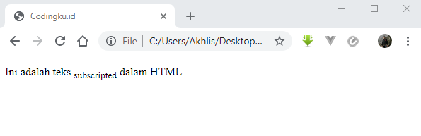

# Cara Mengatur Format Penulisan Teks pada HTML

Apa yang akan kamu lakukan jika menjumpai sebuah artikel di internet yang format penulisan teksnya tidak rapi?

Saya yakin kamu akan menjadi malas untuk membacanya sehingga mengabaikannya begitu saja.

Karena itulah sebagai frontend web developer sangat penting untuk menguasai format penulisan teks pada HTML.

Tampilan teks yang menarik pada halaman website akan berpengaruh terhadap kenyamanan para pengunjung agar betah membaca artikelnya sampai selesai.

## Mengatur Format Elemen HTML

Pada tutorial sebelumnya sudah dibahas penggunaan atribut `style` untuk mengatur teks pada HTML.

Namun perlu kamu ketahui bahwa HTML sebenarnya juga telah menyediakan tag khusus untuk mengatur format teks pada elemen HTML.

Misalnya tag `<b>` dan `<i>` akan menampilkan teks pada halaman website sebagai teks tebal dan italic/miring.

Format elemen didesain untuk menampilkan tipe teks khusus seperti:

- `<b>` - Teks tebal
- `<strong>` - Teks yang memiliki penekanan khusus (tebal)
- `<i>` - Teks italic/miring
- `<em>` - Teks emphasis atau memiliki penekanan khusus (miring)
- `<mark>` - Teks yang ditandai
- `<small>` - Teks kecil
- `<del>` - Teks terhapus
- `<ins>` - Teks insert/disisipkan
- `<sub>` - Teks subscript
- `<sup>` - Teks superscript

## Tag `<b>` dan `<strong>` untuk Membuat Teks Tebal dalam HTML

Meski tag `<b>` dan `<strong>` sama-sama bisa digunakan untuk membuat format teks menjadi tebal pada HTML, namun ada sedikit perbedaan dalam penerapannya.

Tag `<b>` digunakan untuk membuat teks tebal biasa tanpa ada penekanan khusus. 

Misalnya seperti yang ada di kamus [kbbi online](https://kbbi.web.id/internet) untuk menuliskan tema dan subtema.

```html
<p><b>internet</b> artinya jaringan komunikasi elektronik yang menghubungkan jaringan komputer dan fasilitas komputer yang terorganisasi di seluruh dunia melalui telepon atau satelit.</p>

```


Sedangkan tag `<strong>` digunakan untuk membuat teks tebal dengan penekanan khusus.

Contohnya pada ungkapan berikut:

```html
<p><i> divide <strong>et</strong> impera</i></p>
```

Kata `et` yang berarti `dan` digunakan sebagai bentuk penegasan bagian tulisan yang telah ditulis menggunakan huruf miring.


> Alternatif untuk membuat format teks tebal dengan CSS, kamu bisa menggunakan syntax berikut:
```css
font-weight: bold;
```

## Tag `<i>` dan `<em>` untuk Membuat Teks Miring dalam HTML


Tag `<i>` digunakan untuk membuat teks miring biasa tanpa ada penekanan khusus. 

```html
<p>Nama ilmiah padi adalah <i>oryza sativa</i>.</p>

```


Sedangkan tag `<em>` digunakan untuk membuat teks miring dengan penekanan khusus.

Perhatikan kalimat berikut!

```html
<p>Blog ini <em>tidak bermaksud</em> untuk menggurui pembaca, tetapi hanya media <em>sharing</em></p>
```


> Alternatif untuk membuat format teks miring/italic dengan CSS, kamu bisa menggunakan syntax berikut:
```css
font-style: italic;
```

## Tag `<small>` untuk Membuat Teks Kecil dalam HTML

Tag `<small>` digunakan untuk membuat teks kecil dalam HTML.

```html
<p>Ini adalah teks <small>kecil</small> dalam HTML</p>
```


## Tag `<mark>` untuk Membuat Teks Berwarna dalam HTML

Tag `<mark>` digunakan untuk membuat teks berwarna atau tertandai dalam HTML.

```html
<p>Ini adalah teks <mark>tertandai/berwarna</mark> dalam HTML.</p>
```


## Tag `<del>` untuk Membuat Teks Terhapus/Garis Tengah dalam HTML

Tag `<del>` digunakan untuk membuat teks terhapus atau garis tengah dalam HTML.

```html
<p>Ini adalah teks <del>terhapus/garis tengah</del> dalam HTML.</p>
```


## Tag `<ins>` untuk Membuat Teks Garis Bawah dalam HTML

Tag `<del>` digunakan untuk membuat teks garis bawah dalam HTML.

```html
<p>Ini adalah teks <ins>garis bawah</ins> dalam HTML.</p>
```


> Alternatif untuk membuat format teks garis bawah dengan CSS, kamu bisa menggunakan syntax berikut:
```css
text-decoration: underline;
```

## Tag `<sub>` untuk Membuat Teks Subscripted dalam HTML

Tag `<sub>` digunakan untuk membuat teks <sub>subscripted</sub> dalam HTML.

```html
<p>Ini adalah teks <sub>subscripted</sub> dalam HTML.</p>
```



## Tag `<sup>` untuk Membuat Teks Superscripted dalam HTML

Tag `<sup>` digunakan untuk membuat teks <sup>superscripted</sup> dalam HTML.

```html
<p>Ini adalah teks <sup>superscripted</sup> dalam HTML.</p>
```


