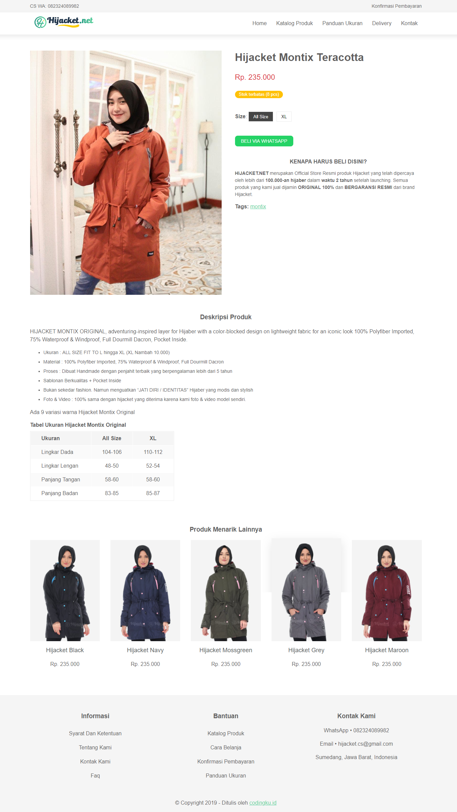
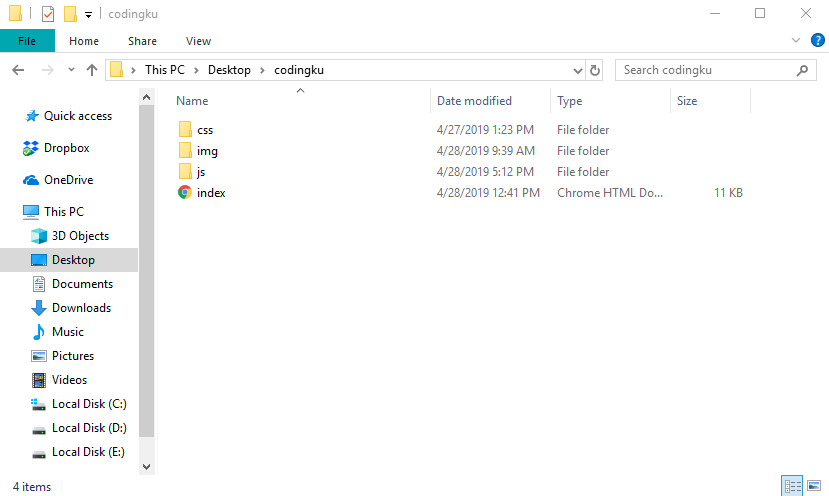

# Cara Mudah Memahami Tag HTML dengan Praktek Membuat Halaman Web

Kebanyakan orang berpikir kalau belajar bahasa pemrograman web itu sulit.

Hal ini terjadi karena mereka belum tahu cara yang mudah dan efektif dalam memahami teknik-tekniknya.

Nah kalau kamu ingin tahu bagaimana caranya, yuk mulai dari belajar bahasa HTML.

Cara paling mudah untuk belajar HTML yaitu dengan langsung praktek menulis ulang script kode HTML yang sudah ada pada tutorial di web [codingku.id](/) ini.

Pada seri tutorial ini, kita akan membuat halaman detail produk seperti yang ada di toko online [hijacket.net](https://hijacket.net/hijacket-montix-teracotta). 

Begini tampilannya:



[Lihat demo lengkapnya](/demo-html/demo-website)

Desain layout halaman produk ini sengaja saja pilih karena dengan mengamati struktur kode HTML yang dipakai, saya jamin kamu akan lebih mudah memahami fungsi-fungsi tag HTML dan cara menggunakannya.

Sebab dalam source codenya bisa dijumpai hampir sebagian besar tag HTML yang sering dipakai untuk membuat website.

Jangan khawatir kalau kamu belum mengenal tag-tag HTML yang digunakan, karena tag-tag HTML tersebut bisa kamu pelajari di bagian tutorial selanjutnya.

Yuk mulai membuat halaman produk diatas dalam bentuk file HTML.

## Inilah Persiapan sebelum Membuat Website:

Sebelum mengikuti tutorial ini, buatlah folder baru di laptopmu untuk menempatkan file-file yang akan dibutuhkan dalam website.

Agar lebih mudah, folder baru tersebut berilah nama _codingku_. Kemudian didalam folder _codingku_ buatlah file baru bernama index dengan ekstensi `.html` seperti ini `index.html`.

Selain file _index_, buat folder baru lagi didalam folder _codingku_ dengan nama _css_ untuk menempatkan file css. Kemudian didalamnya buatlah file baru bernama _style_ dengan ekstensi `.css` seperti ini `style.css` .

Selanjutnya buat lagi folder baru bernama _img_ didalam folder _codingku_ sebagai tempat file gambar.

Begini jadinya struktur dalam folder codingku:

```bash
.
├── index.html
├── css/
│	└── style.css
├── js/
│	└── main.js
└── img/
    ├── gambar_1.png
    ├── gambar_2.jpg
    ├── gambar_3.svg
    └── gambar_4.gif

```

Dan ini tampilan foldernya:




## Inilah Langkah-langkah Membuat Halaman Website dengan HTML

1. Buka aplikasi teks editor kesayanganmu, tapi sebaiknya gunakan saja aplikasi VS Code seperti yang saya gunakan dalam setiap tutorial di codingku.id ini.

2. Pilih menu file pada toolbar kemudian pilih new atau tekan Ctrl + N (pada OS Windows).

3. Dokumen baru akan terbuka, kemudian silakan simpan dokumen baru tersebut dengan cara pilih menu file pada toolbar. Lalu klik menu save as atau tekan Ctrl + Shift + S (pada OS Windows).

4. Simpan file dokumen baru tersebut dengan nama _index_, jangan lupa diberi ekstensi .html atau .htm sebagai ekstensi file HTML. Jadinya seperti ini `index.html`.

5. Pada file `index.html` tuliskan kode dibawah ini:

   ```html
   <!DOCTYPE html>
   <html lang="en">
   
   <head>
       <meta charset="UTF-8">
       <meta name="viewport" content="width=device-width, initial-scale=1.0">
       <meta http-equiv="X-UA-Compatible" content="ie=edge">
       <title>Latihan Membuat Halaman Produk Toko Online</title>
       <meta name="description" content="Latihan membuat halaman deskripsi produk toko online">
   
       <link rel="stylesheet" href="css/style.css">
   </head>
   
   <body>
       <div class="site-wrapper">
           <header>
               <div class="navbar">
                   <div class="navbar-kiri">
                       <span>CS WA: 082324089982</span>
                   </div>
                   <div class="navbar-kanan">
                       <a href="https://hijacket.net/konfirmasi-pembayaran" class="">Konfirmasi Pembayaran</a>
                   </div>
               </div>
               <div class="menu">
                   <div class="logo">
                       <a href="https://hijacket.net"></a>
                   </div>
                   <nav>
                       <ul>
                           <li><a href="https://hijacket.net">Home</a></li>
                           <li><a href="https://hijacket.net/produk">Katalog Produk</a></li>
                           <li><a href="https://hijacket.net/panduan-ukuran">Panduan Ukuran</a></li>
                           <li><a href="https://hijacket.net/delivery">Delivery</a></li>
                           <li><a href="https://hijacket.net/hubungi-kami">Kontak</a></li>
                       </ul>
                   </nav>
               </div>
           </header>
           <main>
               <div class="product">
                   <div class="product-img">
                       
                   </div>
                   <div class="product-info">
                       <h1 class="product-title">Hijacket Montix Teracotta</h1>
                       <p class="product-price">Rp. 235.000</p>
                       <p class="product-inventory"><span>Stok terbatas (8 pcs)</span></p>
                       <div class="product-size">
                           <label><strong>Size</strong></label>:
                           <button class="active"><span>All Size </span></button>
                           <button><span>XL </span></button>
                       </div>
                       <div class="product-order">
                           <a href="https://api.whatsapp.com/send?phone=6282324089982&text=Assalamu%27alaikum%20kak%2C%20saya%20mau%20order%20jaket%20Hijacket%20Montix%20Teracotta%20ini%20apa%20stoknya%20masih%20ada%20ya%20kak%3F" target="_blank" class="product-order__wa"><span>Beli Via Whatsapp</span></a>
                       </div>
                       <div class="product-guaranty">
                           <h4>KENAPA HARUS BELI DISINI?</h4>
                           <p><b>HIJACKET.NET</b> merupakan Official Store Resmi produk Hijacket yang telah dipercaya oleh lebih dari <b>100.000-an hijaber</b> dalam <b>waktu 2 tahun</b> setelah launching. Semua produk yang kami jual dijamin <b>ORIGINAL 100%</b> dan <b>BERGARANSI RESMI</b> dari brand Hijacket.</p>
                       </div>
                       <div class="post-tags">
                           <span><b>Tags: </b></span>
                           <a href="https://hijacket.net/tag/montix" class="post-tags__link"> montix</a>
                       </div>
                   </div>
               </div>
               <article class="product-description">
                   <header>
                       <h3>Deskripsi Produk</h3>
                   </header>
                   <div class="product-content">
                       <p>HIJACKET MONTIX ORIGINAL, adventuring-inspired layer for Hijaber with a color-blocked design on lightweight fabric for an iconic look 100% Polyfiber Imported, 75% Waterproof & Windproof, Full Dourmill Dacron, Pocket Inside.</p>
                       <ul>
                           <li>Ukuran : ALL SIZE FIT TO L hingga XL (XL Nambah 10.000)</li>
                           <li>Material : 100% Polyfiber Imported, 75% Waterproof & Windproof, Full Dourmill Dacron</li>
                           <li>Proses : Dibuat Handmade dengan penjahit terbaik yang berpengalaman lebih dari 5 tahun</li>
                           <li>Sablonan Berkualitas + Pocket Inside</li>
                           <li>Bukan sekedar fashion. Namun menguatkan “JATI DIRI / IDENTITAS” Hijaber yang modis dan stylish</li>
                           <li>Foto & Video : 100% sama dengan hijacket yang diterima karena kami foto & video model sendiri.</li>
                       </ul>
                       <p>Ada 9 variasi warna Hijacket Montix Original</p>
                       <h4 id="tabel-ukuran-hijacket-montix-original"><a href="#tabel-ukuran-hijacket-montix-original" aria-hidden="true"><span class="icon icon-link"></span></a>Tabel Ukuran Hijacket Montix Original</h4>
                       <table>
                           <thead>
                               <tr>
                                   <th align="left">Ukuran</th>
                                   <th align="center">All Size</th>
                                   <th align="center">XL</th>
                               </tr>
                           </thead>
                           <tbody>
                               <tr>
                                   <td align="left">Lingkar Dada</td>
                                   <td align="center">104-106</td>
                                   <td align="center">110-112</td>
                               </tr>
                               <tr>
                                   <td align="left">Lingkar Lengan</td>
                                   <td align="center">48-50</td>
                                   <td align="center">52-54</td>
                               </tr>
                               <tr>
                                   <td align="left">Panjang Tangan</td>
                                   <td align="center">58-60</td>
                                   <td align="center">58-60</td>
                               </tr>
                               <tr>
                                   <td align="left">Panjang Badan</td>
                                   <td align="center">83-85</td>
                                   <td align="center">85-87</td>
                               </tr>
                           </tbody>
                       </table>
                   </div>
               </article>
               <div class="product-related">
                   <header>
                       <h3>Deskripsi Produk</h3>
                   </header>
                   <div class="product-cards">
                       <div class="product-card">
                           <div class="product-card__inner">
                               <div class="product-card__img">
                                   
                               </div>
                               <div class="product-card__info">
                                   <h3>Hijacket Black</h3>
                                   <p>Rp. 235.000</p>
                               </div>
                           </div>
                       </div>
                       <div class="product-card">
                           <div class="product-card__inner">
                               <div class="product-card__img">
                                   
                               </div>
                               <div class="product-card__info">
                                   <h3>Hijacket Navy</h3>
                                   <p>Rp. 235.000</p>
                               </div>
                           </div>
                       </div>
                       <div class="product-card">
                           <div class="product-card__inner">
                               <div class="product-card__img">
                                   
                               </div>
                               <div class="product-card__info">
                                   <h3>Hijacket Mossgreen</h3>
                                   <p>Rp. 235.000</p>
                               </div>
                           </div>
                       </div>
                       <div class="product-card">
                           <div class="product-card__inner">
                               <div class="product-card__img">
                                   
                               </div>
                               <div class="product-card__info">
                                   <h3>Hijacket Grey</h3>
                                   <p>Rp. 235.000</p>
                               </div>
                           </div>
                       </div>
                       <div class="product-card">
                           <div class="product-card__inner">
                               <div class="product-card__img">
                                   
                               </div>
                               <div class="product-card__info">
                                   <h3>Hijacket Maroon</h3>
                                   <p>Rp. 235.000</p>
                               </div>
                           </div>
                       </div>
                   </div>
               </div>
           </main>
           <aside class="widget-footer footer-bg">
               <section class="widget-box">
                   <h3>Informasi</h3>
                   <nav>
                       <ul>
                           <li><a href="#">Syarat dan Ketentuan</a></li>
                           <li><a href="#">Tentang Kami</a></li>
                           <li><a href="#">Kontak Kami</a></li>
                           <li><a href="#">Faq</a></li>
                       </ul>
                   </nav>
               </section>
               <section class="widget-box">
                   <h3>Bantuan</h3>
                   <nav>
                       <ul>
                           <li><a href="#">Katalog Produk</a></li>
                           <li><a href="#">Cara Belanja</a></li>
                           <li><a href="#">Konfirmasi Pembayaran</a></li>
                           <li><a href="#">Panduan Ukuran</a></li>
                       </ul>
                   </nav>
               </section>
               <section class="widget-box">
                   <h3>Kontak Kami</h3>
                   <div>
                       <p>WhatsApp • 082324089982</p>
                       <p>Email • hijacket.cs@gmail.com</p>
                       <p>Sumedang, Jawa Barat, Indonesia</p>
                   </div>
               </section>
           </aside>
           <footer class="footer-bg">
               <div class="copyright">
                   <span>© Copyright 2019 - Ditulis oleh <a href="codingku.id">codingku.id</a></span>
               </div>
           </footer>
       </div>
   
   </body>
   
   </html>
       
   ```

6. Selanjutnya buat lagi file baru didalam folder css dan berilah nama `style`. Jangan lupa simpan file tersebut dengan ekstensi `.css` sehingga menjadi seperti ini `style.css`.

   File css ini fungsinya untuk membuat layout dan style agar tampilan halaman websitenya menjadi cantik dan menarik.

   Lalu tuliskan kode script css dibawah ini:

   ```css
   body {
     background: #fff;
     color: #5e5e5e;
     font-family: "Helvetica Neue", Helvetica, Arial, sans-serif;
     font-size: 16px;
     line-height: 1.5;
     margin: 0 auto;
     max-width: 1170px;
     overflow-x: hidden;
   }
   
   h1,
   h2,
   h3,
   h4,
   h5,
   h6 {
     color: #615d5d;
     font-weight: 600;
     line-height: 1.3;
     margin: 0 0 1em 0;
   }
   
   h1 {
     font-size: 32px;
     margin-top: 0;
   }
   
   h4 {
     margin: 0.5em 0;
   }
   
   a {
     color: #5ed3a2;
   }
   
   body > div {
     display: grid;
     grid-template-areas:
         'header header header'
         'main main main'
         'aside aside aside'
         'footer footer footer';
     grid-column-gap: 30px;
   }
   
   header {
     grid-area: header;
   }
   
   main {
     grid-area: main;
     padding: 3em 0;
   }
   
   aside {
     grid-area: aside;
   }
   
   footer {
     grid-area: footer;
   }
   
   /*header*/
   .navbar,
   .menu {
     position: relative;
     display: flex;
     justify-content: space-between;
   }
   
   .navbar {
     font-size: 14px;
     padding: 8px 0;
   }
   
   .navbar a {
     color: #5e5e5e;
     text-decoration: none;
   }
   
   .navbar a:hover {
     color: #5ed3a2;
     text-decoration: underline;
   }
   
   .navbar:before,
   .menu:before {
     content: "";
     height: 100%;
     left: -100%;
     position: absolute;
     top: 0;
     width: 300%;
   }
   
   .navbar:before {
     background: #f5f5f5;
   }
   
   .navbar-kiri,
   .navbar-kanan {
     position: relative;
   }
   
   .menu {
     align-items: center;
   }
   
   .menu:before {
     box-shadow: 0 6px 12px 0 rgba(0, 0, 0, .08);
   }
   
   .logo,
   nav {
     position: relative;
   }
   
   nav ul {
     margin: 0;
     padding: 0;
     list-style: none;
   }
   
   nav ul li {
     display: inline-block;
     margin: 0;
     padding: 0;
     height: 42px;
   }
   
   nav ul li a {
     text-transform: capitalize;
     text-decoration: none;
     color: #5e5e5e;
     line-height: 42px;
     padding-left: 12px;
     padding-right: 12px;
   }
   
   nav ul li a:hover {
     color: #5ed3a2;
   }
   
   /*product*/
   .product {
     display: flex;
     margin-bottom: 3em;
   }
   
   .product-img,
   .product-info {
     flex: 1;
   }
   
   .product-info {
     padding-left: 2.5em;
   }
   
   .product-price {
     color: #dc3545;
     font-size: 22px;
   }
   
   .product-inventory span {
     color: #fff;
     font-size: 13px;
     background: #ffc107;
     padding: 3px 12px 4px;
     border-radius: 20px;
   }
   
   .product-size {
     padding-top: 1.5em;
     margin-bottom: 2em;
   }
   
   button {
     border: 1px solid #ebebeb;
     background: transparent;
     padding: .5em 1em;
     margin-right: 6px;
     margin-bottom: 1em;
     outline: none;
   }
   
   button:hover {
     color: #fff;
     background: #454545;
   }
   
   button.active {
     color: #fff;
     background: #454545;
   }
   
   .product-order a {
     font-size: 14px;
     color: #fff;
     background: #25d366;
     padding: 8px 18px;
     text-transform: uppercase;
     text-decoration: none;
     border-radius: 8px;
     cursor: pointer;
     background-position: 50%;
     transition: background .8s;
   }
   
   .product-order a:hover {
     background: #2eb962;
   }
   
   .product-guaranty {
     padding-top: 2em;
   }
   
   .product-guaranty h4 {
     text-align: center;
   }
   
   .product-guaranty p {
     font-size: 14px;
   }
   
   .product-description h3 {
     text-align: center;
   }
   
   .product-description p {}
   
   .product-content ul li {
     font-size: 14px;
     margin-bottom: 0.5em;
   }
   
   table {
     border-collapse: separate;
     border-spacing: 1px;
     background: #fff;
     margin-bottom: 1.5em;
     border: 1px solid #ebebeb;
   }
   
   table tr:nth-child(odd) {
     background: #fafafa;
   }
   
   table th,
   table td {
     padding: .5em 2em;
   }
   
   table th {
     background: #f5f5f5;
   }
   
   table td:hover {
     background: #f5f5f5;
   }
   
   /*related product*/
   .product-related {
     padding-top: 2em;
   }
   
   .product-related header h3 {
     text-align: center;
   }
   
   .product-cards {
     display: flex;
     margin-left: -1em;
     margin-right: -1em;
   }
   
   .product-card {
     flex: 1;
     padding-left: 1em;
     padding-right: 1em;
   }
   
   .product-card__inner {
     position: relative;
     transition: transform .3s, background-color .3s, box-shadow .6s;
     padding-bottom: 1em;
   }
   
   .product-card__inner:hover {
     transform: translateY(-5px);
     box-shadow: 1px 10px 30px 0 rgba(0, 0, 0, .1);
   }
   
   .product-card__img img {
     width: 100%;
     height: auto;
   }
   
   .product-card__info {
     text-align: center;
   }
   
   .product-card__info h3 {
     font-size: 18px;
     font-weight: 500;
     margin-top: 0.5em;
   }
   
   /*widget*/
   .widget-footer {
     display: flex;
     text-align: center;
   }
   
   .widget-box {
     flex: 1;
     padding: 2em 0;
   }
   
   .widget-box nav ul li {
     display: block;
   }
   
   footer {
     text-align: center;
     padding: 1em 1.5em;
   }
   
   .footer-bg {
     position: relative;
   }
   
   .footer-bg:before {
     content: '';
     height: 100%;
     left: -100%;
     position: absolute;
     top: 0;
     width: 300%;
     background: #f5f5f5;
   }
   
   .widget-box,
   .copyright {
     position: relative;
   }
   ```

Selamat kamu sudah bisa membuat halaman website sendiri. 

[Lihat demo lengkapnya](/demo-html/demo-website)

[Download source file](/demo-html/demo-website.zip)

Semoga tutorial ini bisa memudahkanmu dalam belajar bahasa pemrograman web khususnya HTML dan CSS. Dan jangan lupa untuk membagikan tutorial ini kepada teman-temanmu agar mereka juga bisa merasakan manfaatnya.

Jika masih ada yang belum paham dan perlu ditanyakan, silahkan tanya lewat kolom komentar dibawah ini ya.