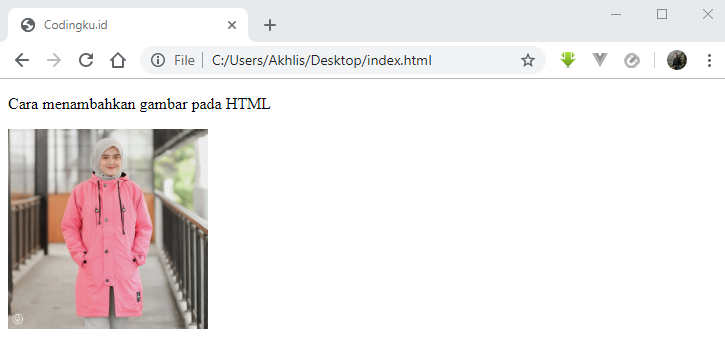
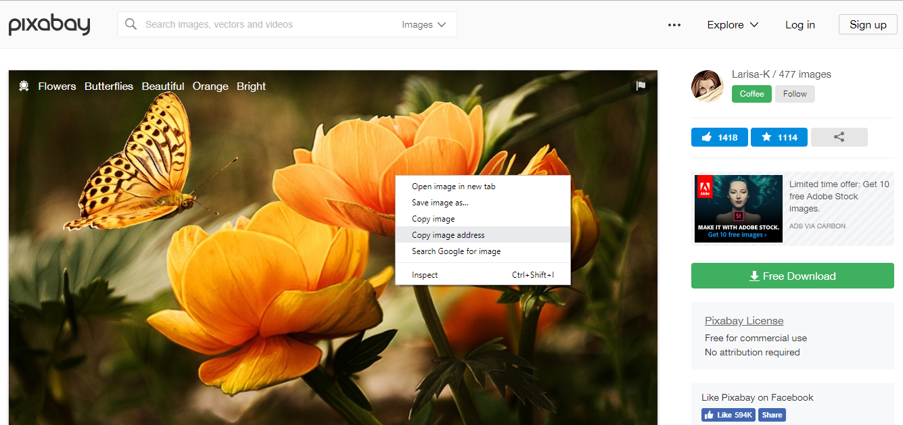
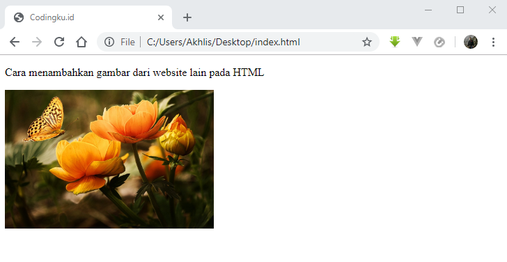
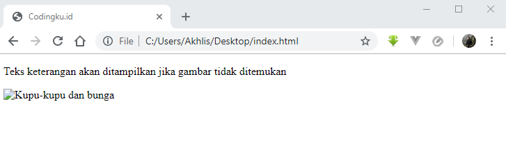

# Cara Menambahkan Gambar pada HTML

Salah satu elemen penting yang bisa meningkatkan ketertarikan pengunjung pada website yaitu dengan menggunakan gambar.

Pemilihan gambar yang tepat juga akan membuat tampilan desain website menjadi semakin menarik.

Nah untuk menambahkan gambar pada HTML kamu bisa menggunakan tag ``

Yang perlu diingat, tag `` ini merupakan tag kosong dan hanya memiliki atribut saja tanpa memiliki tag penutup.

Begini sintaksnya:

```html

```

## Atribut `src` pada tag ``

Atribut `src` digunakan untuk menentukan _URL_ atau lokasi gambar berada.

Lokasi gambar bisa diambil dari folder lokal dalam website tersebut atau bisa juga diambil dari alamat website yang lain.

Untuk menambahkan gambar dari folder lokal caranya sama seperti yang sudah dibahas pada [tutorial membuat link HTML](/link)

Misalnya jika file `nama_gambar.jpg` berada dalam folder yang sama dengan file `index.html`, maka pada atribut `src` langsung diisi dengan nama file gambar tersebut.

```bash
.
├── index.html
└── nama_gambar.jpg
```

```html

```

Contoh:

```html
<!DOCTYPE html>
<html>
<head>
<title>Codingku.id</title>
</head>
<body>

<p>Cara menambahkan gambar pada HTML</p>


</body>
</html>
```



Sedangkan jika file `nama_gambar.jpg` berada dalam folder yang terpisah dengan file `index.html`, maka pada atribut `src` harus diisi dengan nama foldernya dulu baru diikuti dengan nama file gambar tersebut.

```bash
.
├── index.html
└── img/
    └── nama_gambar.jpg
```

```html

```

Ingat! jangan lupa untuk memberi ekstensi gambar dengan benar pada atribut `src` agar web browser bisa mengenalinya.

Ada banyak format gambar yang didukung oleh HTML seperti GIF, PNG, JPG, JPEG, WMF, PCX, BMP, TIFF, WEBP dan lain sebagainya.

Namun format gambar yang paling sering dipakai pada website yaitu PNG dan JPG/JPEG karena dikenali oleh mayoritas web browser saat ini.


### Menambahkan Gambar dari Website Lain

Selain diambil dari folder lokal, kamu juga bisa menambahkan gambar pada HTML dari website lain.

Caranya dengan menuliskan lokasi direktori gambar tersebut secara lengkap pada atribut `src`.

Tapi syaratnya harus tersambung dengan koneksi internet agar gambarnya bisa ditampilkan.

Pada contoh ini saya mengambil gambar dari website [Pixabay](https://pixabay.com/photos/flowers-butterflies-beautiful-19830/)

Untuk mengetahui lokasi direktori gambarnya, silakan klik kanan pada gambar lalu pilih `copy image address`.



Kemudian taruh lokasi direktori gambar tersebut pada atribut `src`.

```html
<!DOCTYPE html>
<html>
<head>
<title>Codingku.id</title>
</head>
<body>

<p>Cara menambahkan gambar dari website lain pada HTML</p>


</body>
</html>
```

Dan ini tampilannya jika sudah dijalankan pada web browser.




## Atribut `alt` pada tag ``

Atribut `alt` pada tag `` digunakan untuk memberi keterangan pada gambar.

Teks keterangan ini akan ditampilkan pada web browser sebagai pengganti gambar jika gambar tidak bisa ditemukan.

Penyebabnya yaitu lokasi direktori gambar salah, format gambar tidak didukung atau gangguan koneksi internet.

Contoh:

```html

```

Dan ini yang ditampilkan pada web browser jika fila gambar tidak ditemukan.



Teks keterangan pada atribut `alt` ini juga digunakan sebagai kata kunci oleh mesin pencari Google untuk mengenali sebuah gambar.

Jadi usahakan untuk selalu memberi teks keterangan yang relevan dengan gambar karena sangat berpengaruh terhadap SEO.

> *Catatan*: Atribut `alt` pada tag `` ini tidak boleh ditinggalkan

## Tentukan Ukuran Gambar dengan Atribut `width`, `height` atau `style`

Jangan lupa untuk menentukan lebar dan tinggi gambar pada halaman HTML dengan menggunakan atribut `width`, `height` atau `style`.

Contoh:

```html

```

Atribut `width` dan `height` selalu mendefinisikan ukuran gambar dalam ukuran `pixel`.

Contoh dengan atribut `style`:

```html

```

Atribut `width`, `height` atau `style` semuanya valid digunakan pada HTML5, namun sebaiknya gunakan atribut `style` untuk mencegah perubahan ukuran gambar oleh css.