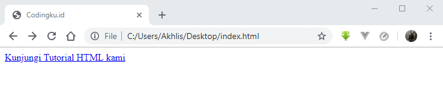
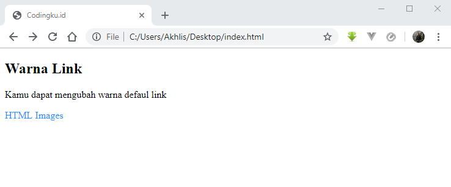
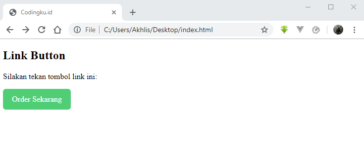

# Cara Membuat Link pada HTML

Hampir semua halaman website pasti terdapat link atau hyperlink.

Tujuan dari link ini adalah untuk menghubungkan antara halaman website yang satu dengan lainnya dengan mudah.

Cukup dengan mengklik link tersebut maka halaman baru akan terbuka.

Untuk membuat link, kamu bisa menggunakan tag `<a>`.

Begini syntaksnya:

```html
<a href="url">teks link</a>
```

Contoh

```html
<a href="https://www.codingku.id/html/">Kunjungi Tutorial HTML kami</a>
```

Atribut `href` digunakan untuk menunjukkan alamat tujuan sebuah link yaitu [https://www.codingku.id/html](https://www.codingku.id/html)

## Cara Membuat Link Lokal

Pada contoh diatas menggunakan URL _absolute_ atau alamat website yang lengkap.

Nah yang dimaksud dengan link lokal yaitu membuat link ke halaman lain yang masih dalam satu website yang sama.

Link lokal biasa disebut juga dengan URL _relative_ (tanpa menggunakan https://www...).

Berikut ini contoh cara membuat link ke halaman yang berada didalam folder `docs` dalam sebuah website.

```html
<a href="/docs/">Tutorial HTML</a>
```

Dan ini cara membuat link ke file `style.css` yang ada didalam folder `css` dengan tag `link`.

```html
<link rel="stylesheet" href="/css/styles.css">
```

Untuk membuat link ke halaman lain yang berada didalam folder yang sama maka `href=` langsung diarahkan ke nama file yang dituju.

Contoh:

```html
<a href="/belajar-coding.html">Tutorial HTML</a>
```

## Cara Mengganti Warna Link

Secara default web browser, teks link akan ditampilkan dengan warna biru disertai dengan garis bawah.



Untuk mengubah warna link, kamu bisa mengikuti contoh berikut:

```html
<!DOCTYPE html>
<html>
<head>
<style>
a:link {
  color: dodgerblue;
  text-decoration: none;
}
a:visited {
  color: pink;
}
a:hover {
  color: red;
  text-decoration: underline;
}
a:active {
  color: yellow;
}
</style>
</head>
<body>

<h2>Warna Link</h2>

<p>Kamu dapat mengubah warna link defaul</p>

<a href="/html-image/" target="_blank">HTML Images</a> 

</body>
</html>
```



## Cara Membuat Link Button (Tombol Link)

Link button mudah sekali dijumpai pada website atau landing page yang menawarkan sebuah produk tertentu.

Biasanya link button ini kalau diklik maka akan diarahkan ke halaman detail produk tersebut.

Nah untuk membuat link button, caranya bisa menggunakan CSS seperti pada contoh berikut:

```html
<!DOCTYPE html>
<html>
<head>
<style>
a:link, a:visited {
  background-color: rgb(79, 206, 118);
  color: white;
  padding: 15px 25px;
  text-align: center;
  text-decoration: none;
  display: inline-block;
  border-radius: 6px;
}

a:hover, a:active {
  background-color: dodgerblue;
}
</style>
</head>
<body>

<h2>Link Button</h2>
<p>Silakan tekan tombol link ini:</p>
<a href="/produk" target="_blank">Order Sekarang</a>

</body>
</html>
```


