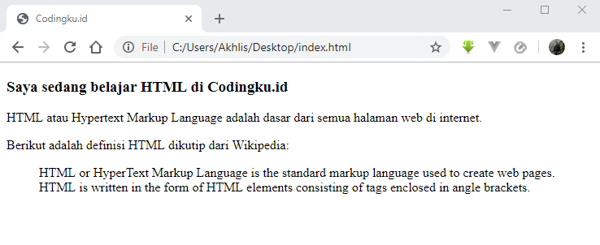
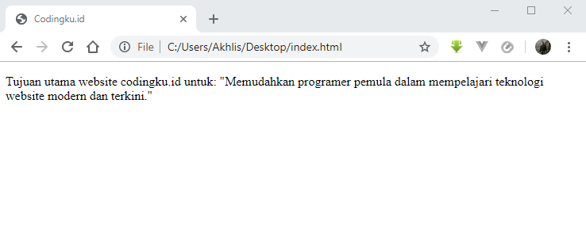

# Cara Membuat Kutipan atau Quote dalam HTML 

Pernahkah kamu menulis sebuah artikel kemudian mencantumkan kalimat yang kamu ambil dari sumber referensi lain?

Dalam menulis sebuah artikel diperlukan beberapa rujukan atau sumber referensi yang bertujuan untuk memperkuat artikel tersebut. 

Teks atau kalimat yang diambil dari sumber referensi lain inilah yang biasa disebut dengan _quote_.

Nah, untuk membuat quote dengan HTML ada 2 tag yang bisa kamu gunakan. Yaitu tag `<blockquote>` dan `<q>`.

Lalu apa perbedaan dari kedua tag tersebut? berikut ini penjelasnnya!

## Tag `<blockquote>` untuk Membuat Kutipan Panjang dalam HTML

Tag `<blockquote>` digunakan untuk membuat kutipan teks yang panjang. 

Dan tag ini merupakan tipe _block element_ yang artinya akan memisahkan diri dari teks sebelumnya atau membuat baris baru.

Selain untuk membuat kutipan teks, biasanya tag `<blockquote>` juga digunakan untuk membuat penegasan pada sebuah kalimat yang penting agar mudah diingat.

Dalam web desain, tag `<blockquote>` juga sering dipakai untuk penulisan testimoni.

Berikut ini contoh penulisan dengan tag `<blockquote>` dalam HTML:

```html
<!DOCTYPE html>
<html>
    <head>
        <title>Belajar HTML lengkap di Codingku.id</title>
    </head>

    <body>
        <h3>Saya sedang belajar HTML di Codingku.id</h3>
        <p>HTML atau Hypertext Markup Language adalah dasar dari semua 
        halaman web di internet.</p>
        <p>Berikut adalah definisi HTML dikutip dari Wikipedia: </p>
        <blockquote>HTML or HyperText Markup Language is the standard markup language used to create web pages. HTML is written in the form of HTML elements consisting of tags enclosed in angle brackets.</blockquote>
    </body>
 
</html>
```



Perhatikan contoh diatas, teks didalam tag `<blockquote>` akan ditampilkan sebagai baris baru yang menjorok(_indent_) kedalam beberapa pixel dari paragraf lainnya.

## Tag `<q>` untuk Membuat Kutipan Pendek dalam HTML

Tag `<q>` digunakan untuk membuat kutipan teks yang pendek dengan HTML dan termasuk tipe _inline element_ sehingga akan tetap menyatu dengan teks sebelumnya.

Teks yang ada didalam tag `<q>` akan ditampilkan diweb browser ditandai dengan tanda kutip.

```html
<html>
    <head>
        <title>Belajar HTML lengkap di Codingku.id</title>
    </head>

    <body>
        <p>Tujuan utama website codingku.id untuk: <q>Memudahkan programer pemula dalam mempelajari teknologi website modern dan terkini.</q></p>
    </body>
 
</html>
```



Pada contoh diatas, teks didalam tag `<q>` akan ditampilkan mengikuti teks sebelumnya dan berada didalam tanda kutip.
